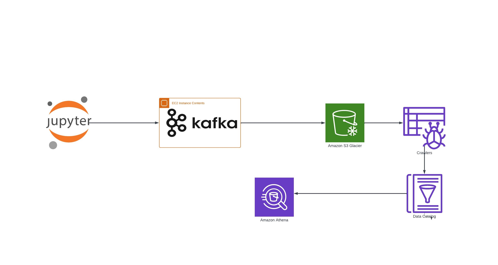
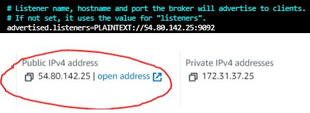
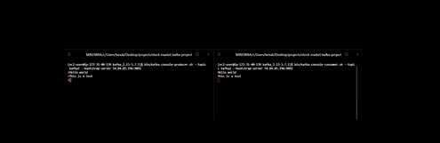
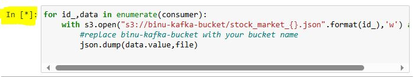

<h2>This project is about real time data analysis using Kafka and Athena</h2>

### ARCHITECTURE

### AWS services and Tools
* EC2
* S3
* Crawler
* Data Catalog
* Athena
* Kafka

### Steps taken to implement this architecture
1. Deploy Apache Kafka on an Amazon EC2 Instance
2. Create an S3 Bucket
3. Use Jupyter Notebook to stimulate live stock data
4. Configure a Crawler and a Data Catalog
5. Utilize Athena to Run SQL Queries

## 1. Deploy Apache Kafka on an Amazon EC2 Instance
### Launch an EC2 Instance on AWS
* In the AWS Management Console, search for "EC2" in the search bar and select it.
* Click on "Launch Instance."
* Choose a name for your EC2 instance.
* Select "Amazon Linux" as your Amazon Machine Image (AMI).
* Under "Key pair," create a new key pair and download it for SSH access.

### Launch an EC2 Instance on AWS
* Navigate to "Instances" in the EC2 dashboard.
* Select the instance you launched, then go to the "Security" tab.
* Click on the associated security group to modify its settings.
* Edit the inbound rules by adding a new rule:
  - Set the type to "All traffic."
  - Set the source to "Anywhere-IPv4" to allow connections from any IP address.
* Save the rules.

### SSH into your EC2 from your local machine.
* In the AWS Management Console, search for "EC2" in the search bar and select it.
* Go to "Instances" and click on the instance ID of your EC2 instance.
* Click on "Connect" and choose the "SSH client" tab.
* In the "SSH client" section, you will find the command to connect to your instance. Copy this command to your clipboard.

      ssh -i "stock-market-kafka-key-pair.pem" ec2-user@ec2-54-84-85-196.compute-1.amazonaws.com

* Open a terminal on your local machine.
* Navigate to the directory where your key pair file (.pem) is saved using the cd command.
* Paste and run the copied SSH command in the terminal to connect to your EC2 instance.

### Installing Kafka and Zookeeper
* After connecting to your EC2 instance via SSH, follow these steps to install Kafka:
    Download Kafka
  
        wget https://dlcdn.apache.org/kafka/3.7.1/kafka_2.13-3.7.1.tgz
  
    Extract the Kafka Archive
  
        tar -xzf kafka_2.13-3.7.1.tgz
  
    Kafka requires Java to run. Install it using the following command:
  
        sudo yum install java-22-amazon-corretto-devel

### Configuring Kafka to Use the Public IP Address
* To configure Kafka to use the public IP address instead of the private IP, follow these steps:
    Navigate to Kafka Configuration Directory
            cd kafka_2.13-3.7.1
    Edit the Server Properties File
            sudo nano config/server.properties
* In the file, find the line with advertised.listeners.
* Replace your.host.name with the public IP address of your EC2 instance.
 

* Press Ctrl + X to exit.
* Press Y to confirm the changes
* Press enter to save and exit.

### Starting the Zookeeper Server
* Open a New Terminal
* Connect to Your EC2 Instance via SSH
* Navigate to the Kafka Directory

    cd kafka_2.13-3.7.1

* Start the Zookeeper Server

    bin/zookeeper-server-start.sh config/zookeeper.properties

### Starting the Kafka Server
* Open Another Terminal
* Connect to Your EC2 Instance via SSH
* Set Memory Allocation for Kafka

    export KAFKA_HEAP_OPTS="-Xmx256M -Xms128M"

* Navigate to the Kafka Directory

    cd kafka_2.13-3.7.1

* Start the Kafka Server

    bin/kafka-server-start.sh config/server.properties

### Setting Up Kafka Producer and Consumer
- Create a Topic in Kafka
    * Open a New Terminal
    * Connect to Your EC2 Instance via SSH
    * Navigate to the Kafka Directory

          cd kafka_2.13-3.7.1

    * Create the Topic

          bin/kafka-topics.sh --create --topic your_topic_name --bootstrap-server your-ec2-public-ip:9092 --replication-factor 1 --partitions 1

- Start a Kafka Producer

          bin/kafka-console-producer.sh --topic your_topic_name --bootstrap-server your-ec2-public-ip:9092

- Start a Kafka Consumer
    * Open Another Terminal
    * Connect to Your EC2 Instance via SSH
    * Navigate to the Kafka Directory

          cd kafka_2.13-3.7.1

    * Start the Consumer
  
          bin/kafka-console-consumer.sh --topic your_topic_name --bootstrap-server your-ec2-public-ip:9092

- To verify everything is working correctly, type a message in the producer terminal. You should see the message appear immediately in the consumer terminal.

## 2. Creating an S3 Bucket and IAM User
* Create a User with S3 Access
  - In the AWS Management Console, type "IAM" in the search bar and select it.
  - Navigate to "Users" and click "Add user."
  - Enter a name for the new user.
  - On the next page, select "Attach policies directly."
  - Search for "AmazonS3FullAccess" and check the box to attach this policy.
  - Continue to the next steps and click "Create user."
 
* Generate Access Keys for the User
  - Return to the "Users" section and click on the username you just created.
  - Go to the "Security credentials" tab.
  - Click "Create access key."
  - Select "Command Line Interface (CLI)" and acknowledge the security warning by ticking the confirmation checkbox.
  - Click "Create access key" and download the .csv file containing the access key ID and secret access key. Store this file
  - securely and do not share it publicly.
    
* Configure AWS CLI on Your Local Machine
  - Follow the instructions in the AWS CLI installation guide to install the AWS CLI on your computer.
  - Open a terminal and run the following command:

        aws configure
    
  - Enter the access key ID and secret access key from the .csv file.
  - Set the default region name to match the region where your S3 bucket is located.
 
## 3. Use Jupyter Notebook to stimulate live stock data

* Start the [Consumer Notebook](./kafka_consumer.ipynb) First,
    - Run the notebook (last function should keep running in order to start the producer notebook)
    

    
    

* Run the [Producer Notebook](./kafka-producer.ipynb)
    - Start the producer notebook and allow it to run for a few seconds, generating and sending data.
 
* After stopping the consumer notebook, check your S3 bucket. You should see files containing the simulated stock data that was processed by the consumer.

## 4. Configure a Crawler and a Data Catalog
* Create a Crawler
  - In the AWS Management Console, search for "Glue" and select it.
  - Under the "Data Catalog" section, click on "Crawlers."
  - Click "Add crawler" to start creating a new crawler.
  - Name your crawler and click "Next."
  - For the data source, select "S3" and ensure "In this account" is checked.
  - Browse to select the S3 bucket where your data is stored. Make sure to include a "/" at the end of the path.
  - Add the S3 data source and click "Next."
 
* Create an IAM Role for the Crawler
  - Open a new tab and navigate to IAM.
  - Click on "Roles" and then "Create role."
  - Select "AWS service" and choose "Glue" from the "Use case" dropdown.
  - Click "Next" and select the "AdministratorAccess" policy.
  - Click "Next," name your role, and create it.
 
* Configure Security Settings for the Crawler
  - Return to the Glue crawler setup.
  - Under "Configure security settings," select the IAM role you just created from the "Existing IAM role" dropdown.
  - Click "Next."
 
* Create and Select a Target Database
  - For the "Target database," click on "Add database."
  - Enter a name for the new database and click "Create database."
  - Go back to the Glue crawler setup and select the database you created from the "Target database" dropdown.
  - Click "Next" and then "Create crawler."

* Once the crawler is created, select it from the list and click "Run" to start the crawling process. This will scan your S3 data and update the Glue Data Catalog with metadata about your data.

## 5. Utilize Athena to Run SQL Queries
* Set Up an S3 Bucket for Athena Query Results
  - Ensure you have an S3 bucket created specifically for storing Athena query results.

* Configure Athena Settings
  - After your Glue crawler has successfully run, search for "Athena" in the AWS Management Console.
  - Go to "Settings" and select "Manage."
  - Browse and choose the S3 bucket you created for query results, then save the settings.
 
* Querying Data in Athena
  - Select "AwsDataCatalog" as your data source.
  - Choose the database created by your Glue crawler.
  - Click the three dots next to a table and select "Preview table."
  - To monitor data changes, run the following query in the query editor

        SELECT COUNT(*) FROM "your_database_name"

* To perform real-time analysis, start both the consumer and producer notebooks that simulate live stock data.
  
* As the notebooks run, query your data using Athena. You will observe the count increasing in real-time as new data is ingested.
  
## 5. Cleanup
* Cleanup
After completing your analysis, ensure that you clean up all the resources you created, such as EC2 instances, S3 buckets, and Glue crawlers, to avoid unexpected charges.

## Congratulations! :+1:

